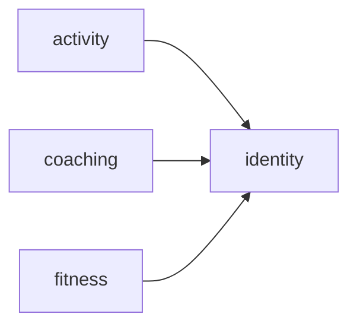
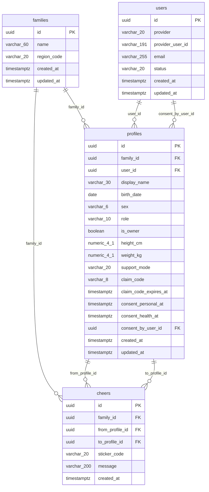
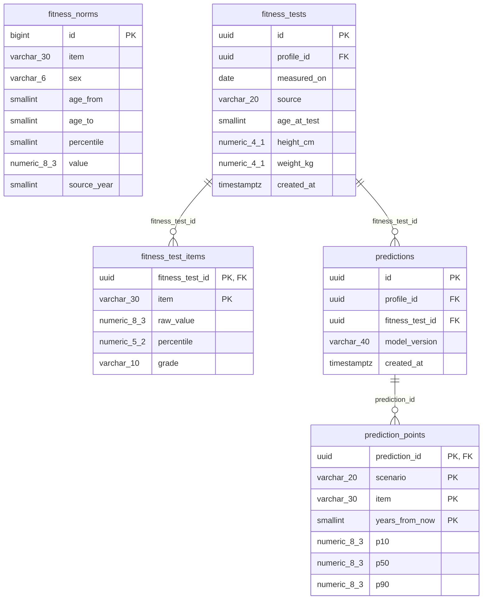
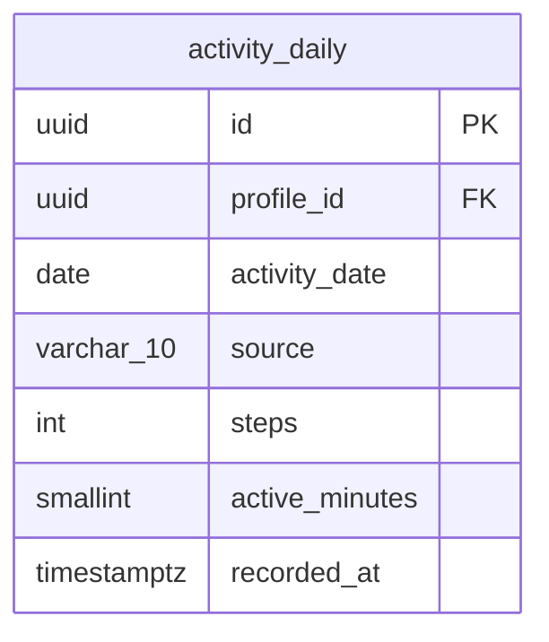
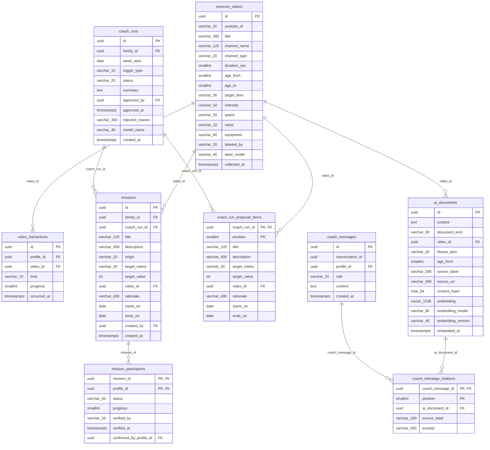

# ERD — 우리가족 체력키움 (family-fitness)

**테이블 19개 · FK 29개 · 모듈 4개 · JSONB 0개**

> [ADR-001](./adr/ADR-001-ddd-hexagonal-and-relational-data.md)에 따른 **목표 ERD 초안**입니다.
> 현재 Flyway 마이그레이션에 적용된 실스키마가 아니므로, 마이그레이션·backfill·검증 뒤에만 적용합니다.

## 줄인 기준

기존 14개에서 JSONB를 제거해 19개가 됐습니다. 아래 규칙으로 불필요한 테이블 증가는 막습니다.

| 뺀 것 | 왜 |
|---|---|
| 로그 테이블 4종 (동기화·API호출·이벤트·설문) | 애플리케이션 로그와 CloudWatch 로 충분하다. DB 에 넣으면 관리 대상만 늘어난다 |
| 확장 훅 7종 (뱃지·리그·포인트·리워드·월간리포트·체력나이·알림) | 5주차 출품 범위가 아니다. 필요해지면 그때 마이그레이션 한 장 |
| 1:1 분해 (영상↔라벨) | 영상의 라벨은 영상 속성이라 한 테이블에 둔다 |
| 마스터 테이블 (측정 항목 코드) | 20개 미만에 배포 없이는 안 바뀐다 → Kotlin enum |
| 이벤트 발행 레지스트리 | 모듈이 넷뿐이고 아직 모듈 간 이벤트가 없다 |

### JSONB 제거 기준

독립적으로 식별·변경·조회되는 값은 행으로 분리합니다. 반대로 코치 도구 실행 단계는 업무 데이터가
아니므로 DB가 아니라 로그/추적 시스템에 보냅니다.

| 기존 JSONB 컬럼 | 목표 구조 |
|---|---|
| `fitness_tests.items` | `fitness_test_items` — 항목별 추세와 규준 검증 |
| `predictions.curves` | `prediction_points` — 시나리오·항목·시점별 예측 |
| `predictions.input_snapshot`, `metrics` | 제거 — 원천 측정 FK와 모델 버전으로 재현 |
| `missions.participants` | `mission_participants` — 참여자별 완료·검증 |
| `coach_runs.proposal` | `coach_run_proposal_items` — 승인 전 제안 항목 |
| `coach_runs.steps` | 제거 — 애플리케이션 로그/trace |
| `vector_store.metadata` | `ai_documents`의 명시 컬럼 |
| `coach_messages.citations` | `coach_message_citations` |

이 설계의 이행 순서는 [DDD·헥사고날 전환 가이드](./ddd-hexagonal-guide.md)를 따릅니다.

### AI 인덱스의 소유권

PostgreSQL 데이터베이스는 하나만 사용하고 `pgvector` 확장을 함께 설치한다. 단, 이것이 Spring
Boot가 AI·벡터 검색을 구현한다는 뜻은 아니다. Spring Boot는 가족·측정·코치 실행·미션처럼
업무 데이터를 소유하고, 별도 Python AI 서비스가 `ai_documents`의 임베딩 생성과 RAG 검색을
담당한다.

Python 서비스에는 `ai_documents`와 `exercise_videos` 읽기 전용 권한에 한정된 DB 역할을 부여한다.
`coach_runs`, `missions`, `coach_messages`의 생성·변경은 Python 서비스가 직접 쓰지 않고 Spring
Boot API가 처리한다. AI 서비스는 검색 결과의 `ai_document_id`와 근거를 반환하고, Spring Boot가
그 ID를 인용으로 저장한다.

## 모듈 의존

Spring Modulith 모듈 경계 = 업무 ERD 묶음 = 백엔드 패키지. 셋이 1:1입니다. `ai_documents`는
Python AI 서비스가 사용하는 기술 인덱스라 이 업무 모듈 경계 밖에 둡니다.

## 1. identity — 계정 · 가족 · 구성원

계정(users)과 사람(profiles)을 나눈 게 핵심. 두 살 아이는 계정 없이 프로필로만 살고, 나중에 합류하는 남편은 미리 만들어 둔 프로필을 초대코드로 가져간다.

`users`는 OAuth 전용 계정이다. `provider`와 `provider_user_id` 조합으로만 사용자를 식별하며,
서비스 아이디·비밀번호나 비밀번호 해시 컬럼은 두지 않는다.

## 2. fitness — 규준 · 측정 · 예측

측정 항목 마스터는 테이블이 아니라 Kotlin enum(FitnessItem)이다. 다만 측정 회차의 항목 값은
독립적으로 조회되므로 `fitness_test_items`에 둔다.

## 3. activity — 활동 기록

웹(PWA)이라 HealthKit·Health Connect 를 못 쓴다. 걸음수는 자기 신고, 영상 완주와 타이머만 서버가 안다.

## 4. coaching — 영상 · AI 인덱스 · 코치 · 미션

coach_runs.approved_at 이 NULL 인 동안에는 missions 가 단 한 건도 생기지 않는다. CoachApprovalGateTest 가 증명한다.

