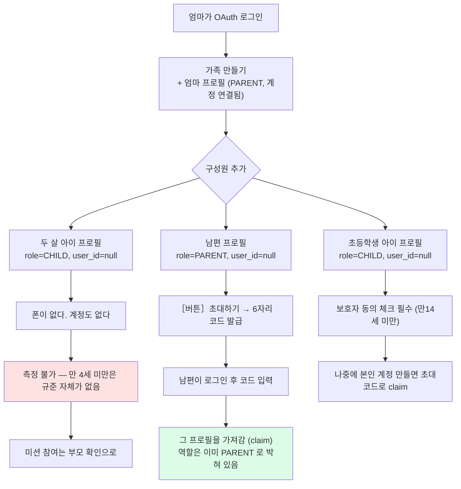
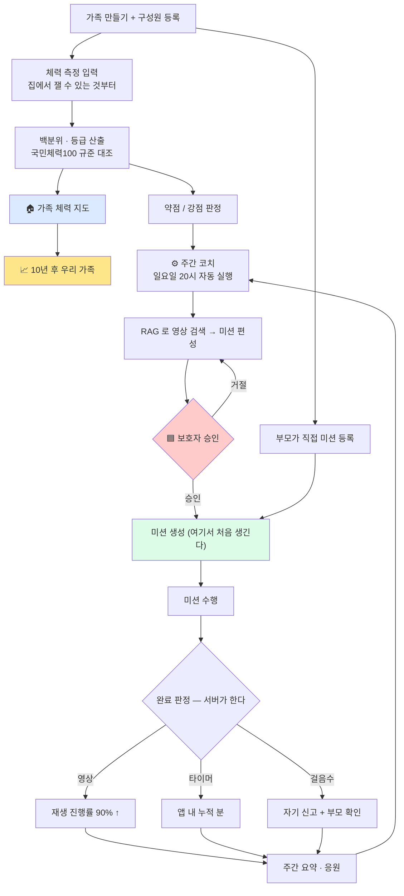
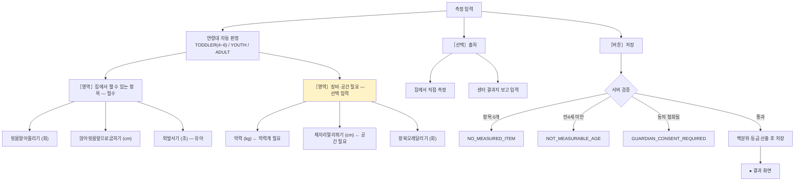
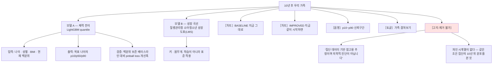
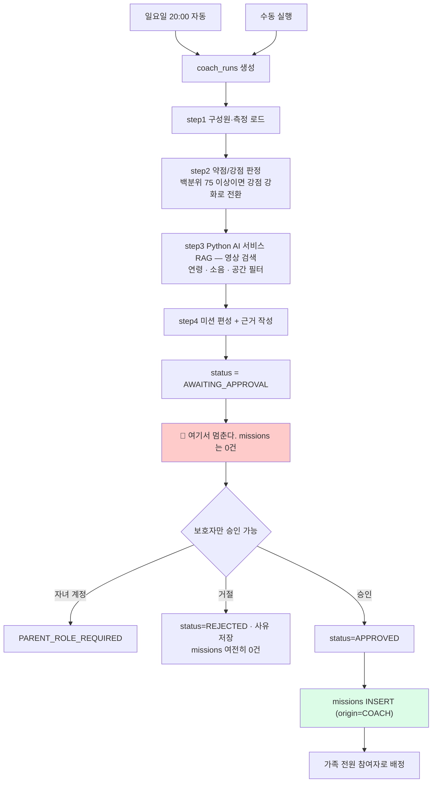
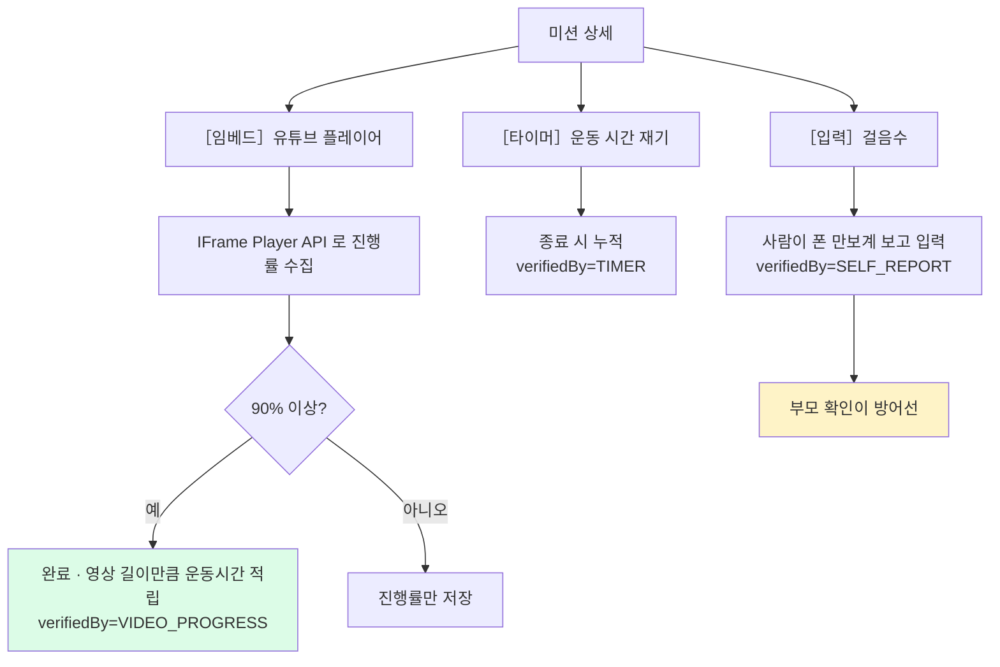

# 유저 플로우 — 우리가족 체력키움 (family-fitness)

- 대상: **웹 (PWA)**. 앱스토어에 올리지 않고 링크로 바로 들어간다.
- 범위: 5주차 출품 범위. `[확장]` 은 그 이후.
- 상태: ● 구현됨 · ○ 설계안 · ◐ 확장 · ▲ 확인 필요

---

## 0. 웹이라서 못 하는 것 — 먼저 짚고 간다

| 신청서/1차 회의에 있던 것 | 웹에서 되나 | 대체 |
|---|---|---|
| HealthKit / Health Connect 연동 | **불가** — 네이티브 앱 전용 API | 걸음수 수동 입력 |
| 걸음수 자동 동기화로 미션 자동 완료 | **불가** | 영상 완주·타이머로 자동 판정 |
| 체력인증센터 기록 자동 조회 | **불가** — 개인 기록 조회 API 자체가 없다 | 결과지 보고 직접 입력 |
| KSPO MCP 서버 | 뺐다 | 규준 CSV 배치 적재 |

**웹에서 서버가 진짜로 아는 건 두 가지다** — 유튜브 재생 진행률, 앱 내 타이머. 미션 자동 인증은 이 둘 위에만 세운다.
걸음수는 자기 신고고, 그렇게 부른다. 자동 실측인 척하면 시연 자리에서 무너진다.

대신 PWA라서 생기는 게 있다. 앱 설치도 심사도 없이 공단이 링크 하나로 배포할 수 있다. 공공 도입성 쪽에서는 오히려 유리하다.

---

## 1. 사이트맵

```mermaid
flowchart TD
    root["/ 스플래시"]

    root --> ob["/onboarding"]
    ob --> ob1["/onboarding/login<br/>OAuth 로그인"]
    ob --> ob2["/onboarding/family<br/>가족 만들기 + 내 프로필"]
    ob --> ob3["/onboarding/members<br/>구성원 추가"]

    root --> claim["/claim<br/>초대코드로 합류"]

    root --> home["/home<br/>가족 체력 지도 ★메인"]

    root --> me["/p/:profileId"]
    me --> me1["/p/:id/measure<br/>측정 입력"]
    me --> me2["/p/:id/result<br/>결과 · 백분위 · 등급"]
    me --> me3["/p/:id/future<br/>10년 후 ★데모"]

    root --> coach["/coach"]
    coach --> co1["/coach/weekly<br/>이번 주 제안"]
    coach --> co2["/coach/chat<br/>AI 운동 코치 질의응답"]

    root --> ms["/missions"]
    ms --> ms1["/missions/:id<br/>영상 · 타이머 · 진행"]

    root --> vid["/videos"]
    vid --> vid1["/videos/favorites<br/>찜"]
    vid --> vid2["/videos/recent<br/>최근 본 영상"]

    root --> fam["/family"]
    fam --> fa1["/family/cheer<br/>응원 보내기"]
    fam --> fa2["/family/report<br/>주간 요약"]
    fam --> fa3["/family/facilities<br/>근처 체육시설 · 강좌"]

    root --> st["/settings"]
    st --> st1["/settings/support-mode<br/>부모 응원 모드"]
    st --> st2["/settings/consent<br/>보호자 동의 관리"]
```



---

## 2. 계정과 프로필 — 여기가 제일 헷갈리는 부분

**계정(user)과 사람(profile)은 다르다.** 로그인은 계정이 하고, 측정·미션·활동은 전부 프로필에 달린다.



**가족 단위 초대코드를 안 만든 이유** — 코드 하나를 돌리면 받는 사람이 "나 부모야"라고 주장할 수 있다.
부모 권한은 곧 코치 제안 승인 권한이라 그렇게 열어둘 수 없다. 초대는 항상 특정 프로필로의 초대다.

**엣지 케이스 정리**

| 상황 | 처리 |
|---|---|
| 아이디·비밀번호 가입 | 지원하지 않는다. OAuth 제공자 계정으로만 로그인한다 |
| 부모 계정 하나로 전부 | 아무에게도 초대를 안 열면 된다. 프로필 여러 개를 한 계정이 관리 |
| 두 살 아이 | 프로필만 존재. 측정 버튼이 화면에 안 뜬다 (`measurable=false`) |
| 남편 나중에 합류 | 프로필 먼저 → 초대코드 → claim |
| 아이가 커서 자기 계정 | 같은 방식으로 claim. 기존 측정 기록이 그대로 따라온다 |
| 한 계정이 여러 가족 | 허용 (재혼·조부모). `(family_id, user_id)` 로만 유일 |
| 동의 철회 | 그 시점부터 측정·활동 저장이 403 |

---

## 3. 전체 여정



---

## 4. 화면별 상세

### 4.1 측정 입력 `/p/:id/measure` ●



> **악력을 필수로 안 받는 이유** — 악력계가 있는 집이 거의 없다. 첫 화면에서 장비를 요구하면 거기서 이탈한다.
> `FitnessItem.optionalInput()` 이 이 구분을 들고 있고, 프론트는 그 플래그로 폼을 두 구역으로 나눈다.

### 4.2 가족 체력 지도 `/home` ● ★메인

한 번의 호출로 홈 화면 전체가 온다 — `GET /api/v1/families/{id}/fitness-map`

- 구성원 카드: 이름 · 나이 · "40대 상위 30%" · 약점 항목 · 응원 모드
- 측정 없는 구성원: `headline=null` → "첫 측정을 등록하면 지도가 그려져요"
- 두 살 아이: `measurable=false` → 측정 버튼 자체가 안 뜬다

### 4.3 10년 후 `/p/:id/future` ○ ★데모



> **화면에서 지킬 것** — "당신은 10년 뒤 이렇게 됩니다"가 아니라 "지금과 같은 조건의 10년 위 연령대는 여기 있습니다".
> 국민체력100은 횡단면 데이터라 개인 추적이 애초에 불가능하다. 발표에서 이걸 먼저 밝히는 게 점수가 된다.

### 4.4 주간 코치 `/coach/weekly` ○ ★AI 서사



**응원 모드가 편성을 바꾼다**

| 모드 | 부모 본인 미션 | 화면 |
|---|---|---|
| `CHEER_ONLY` 응원만 | 안 만든다 | 아이 진행 + 칭찬 버튼만 |
| `WEEKEND_TOGETHER` 주말에 같이 | 주말 미션만 | 같이 할 미션 강조 |
| `MEASURE_TOO` 나도 측정 | 본인 맞춤 미션 | 아이와 같은 화면 |

> **회의 (6) 증명** — `CoachApprovalGateTest` 6개가 실제 DB 위에서 돈다.
> 승인 전 미션 0건 / 승인 우회 시 예외 / 비보호자 승인 차단 / 거절 시 0건 / 승인 후 생성 / 중복 승인 차단.

### 4.5 AI 운동 코치 질의응답 `/coach/chat` ○

별도 Python AI 서비스가 RAG 검색과 답변 생성을 담당한다. Spring Boot는 프로필·권한에 맞는
검색 조건만 전달하고, 반환된 `ai_document_id`를 인용으로 저장한다. 답변마다 `citations` 에
근거를 남긴다 — 근거 없는 ASSISTANT 답변은 버그로 본다.

```
사용자: 우리 애가 유연성이 약한데 층간소음 없이 할 수 있는 운동 있어?
코치:  [RAG 검색: 유연성 + QUIET + SMALL_ROOM + 7세]
       → 답변 + 인용 3건 (영상 2 · 운동처방 1)
```

### 4.6 미션 수행 `/missions/:id` ○



---

## 5. API 요약

| 화면 | 메서드 · 경로 | 상태 |
|---|---|---|
| 개발 전용 토큰 발급 | `POST /api/v1/auth/dev-token` | ● 로컬 개발 프로필 전용; 운영 로그인 수단이 아님 |
| 가족 만들기 | `POST /api/v1/families` | ● |
| 구성원 추가 | `POST /api/v1/families/{id}/profiles` | ● |
| 초대코드 열기 | `POST /api/v1/profiles/{id}/invite` | ● |
| 초대코드로 합류 | `POST /api/v1/profiles/claim` | ● |
| 내 프로필 목록 | `GET /api/v1/me/profiles` | ● |
| 응원 모드 변경 | `PATCH /api/v1/profiles/{id}/support-mode` | ● |
| 동의 철회 | `DELETE /api/v1/profiles/{id}/guardian-consent` | ● |
| 측정 항목 목록 | `GET /api/v1/fitness/items?ageGroup=` | ● |
| 측정 등록 | `POST /api/v1/profiles/{id}/fitness-tests` | ● |
| 최신 결과 | `GET /api/v1/profiles/{id}/fitness-tests/latest` | ● |
| **가족 체력 지도** | `GET /api/v1/families/{id}/fitness-map` | ● |
| 걸음수 입력 | `POST /api/v1/profiles/{id}/activity/steps` | ● |
| 타이머 종료 | `POST /api/v1/profiles/{id}/activity/timer` | ● |
| 가족 활동 합계 | `GET /api/v1/families/{id}/activity` | ● |
| **코치 실행** | `POST /api/v1/families/{id}/coach/runs` | ● |
| 제안 조회 | `GET /api/v1/coach/runs/{id}` | ● |
| **승인** | `POST /api/v1/coach/runs/{id}/approve` | ● |
| 거절 | `POST /api/v1/coach/runs/{id}/reject` | ● |
| 부모 미션 등록 | `POST /api/v1/families/{id}/missions` | ● |
| 진행 갱신 | `POST /api/v1/missions/{id}/progress` | ● |
| 10년 후 예측 | `POST /api/v1/profiles/{id}/predictions` | ○ 3주차 |
| 영상 추천 | `GET /api/v1/profiles/{id}/videos/recommend` | ○ 3주차 |
| 찜 / 최근 | `GET /api/v1/profiles/{id}/videos/favorites` `.../recent` | ○ 3주차 |
| 코치 질의응답 | `POST /api/v1/coach/chat` | ○ 5주차 |
| 주간 요약 | `GET /api/v1/families/{id}/report` | ○ 5주차 |
| 시설·강좌 | `GET /api/v1/facilities` | ○ 5주차 |

---

## 6. 아직 확정 안 된 것

1. **측정 항목 코드 매핑 ▲** — `FitnessItem` enum 은 초안. 활용신청 후 실제 API 응답과 대조해야 한다. 틀리면 백분위가 통째로 틀어진다.
2. **유아기(48~83개월) 데이터 실물 ▲** — 레코드 수와 최초 측정연월. 소량이면 유아 타깃을 접어야 한다.
3. **공단 유튜브 영유아 재생목록 규모 ▲** — 영상 수·연령대 커버리지.
4. **소셜 로그인 3종 다 필요한지** — 카카오만이면 온보딩이 한 단계 짧아진다.
5. **시설·강좌 데이터 출처** — 공공데이터포털 어느 API 를 쓸지.
6. **결과지 OCR** — LLM 비전이면 되지만 5주차 범위는 아니다. 확장 후보.
